<div align="center">

# 🎓 Student Management Portal

### A Full-Stack MERN Application for College Administration

[](https://www.mongodb.com/)
[](https://expressjs.com/)
[](https://reactjs.org/)
[](https://nodejs.org/)
[](#)

**Version:** 1.0.0 &nbsp;|&nbsp; **License:** MIT &nbsp;|&nbsp; **Status:** Production Ready

</div>

---

## 📑 Table of Contents

| # | Section | # | Section |
|---|---------|---|---------|
| 1 | [Project Overview](#1-project-overview) | 15 | [Security Implementation](#15-security-implementation) |
| 2 | [Project Introduction](#2-project-introduction) | 16 | [Performance Optimization](#16-performance-optimization) |
| 3 | [Tech Stack](#3-tech-stack) | 17 | [Deployment Documentation](#17-deployment-documentation) |
| 4 | [System Architecture](#4-system-architecture) | 18 | [Environment Variables](#18-environment-variables) |
| 5 | [Folder Structure](#5-folder-structure) | 19 | [Error Handling](#19-error-handling) |
| 6 | [User Roles & Permissions](#6-user-roles--permissions) | 20 | [Testing Documentation](#20-testing-documentation) |
| 7 | [Authentication & Authorization](#7-authentication--authorization-flow) | 21 | [Screenshots](#21-screenshots) |
| 8 | [Complete User Flow](#8-complete-user-flow) | 22 | [Future Enhancements](#22-future-enhancements) |
| 9 | [Features Documentation](#9-features-documentation) | 23 | [Challenges Faced](#23-challenges-faced) |
| 10 | [API Documentation](#10-api-documentation) | 24 | [Learning Outcomes](#24-learning-outcomes) |
| 11 | [Database Documentation](#11-database-documentation) | 25 | [Conclusion](#25-conclusion) |
| 12 | [Frontend Documentation](#12-frontend-documentation) | 26 | [README / Setup Guide](#26-readme--setup-guide) |
| 13 | [Backend Documentation](#13-backend-documentation) | 27 | [Diagrams Index](#27-diagrams-index) |
| 14 | [Seed Data & Defaults](#14-seed-data--default-credentials) | | |

---

# 1. Project Overview

## 📌 Project Name
**Student Management Portal**

## 📌 Problem Statement
Educational institutions require a centralized, digital system for managing student records, faculty assignments, subject allocations, and daily hour-wise attendance tracking. Manual processes using registers and spreadsheets are error-prone, time-consuming, and lack real-time visibility for students and administrators.

## 📌 Purpose of the Project
To build a fast, clean, demo-ready **MERN stack** web application that digitizes the core administrative operations of a college — student management, subject creation, faculty allocation, and hour-wise attendance marking — with role-based access control and real-time attendance analytics.

## 📌 Real-World Use Case
A college administrator logs in, creates student records for each branch/year/section, defines subjects, assigns faculty to specific classes, and the assigned faculty can then mark hour-wise attendance daily. Students can view their attendance percentage and status alerts in real-time.

## 📌 Target Users

| User | Description |
|------|-------------|
| **College Administrators** | Manage all data — students, subjects, faculty, allocations |
| **Faculty Members** | Mark and review attendance for their assigned classes |
| **Students** | View personal attendance percentage and status |

## 📌 Goals & Objectives
- Eliminate paper-based attendance tracking
- Provide role-based dashboards for Admin, Faculty, and Students
- Enable hour-wise attendance granularity (Hours 1–8)
- Real-time attendance percentage calculation with status alerts
- Secure login with Google Authenticator (TOTP) for Admin/Faculty
- Clean, responsive, and professional UI

## 📌 Key Highlights
- **3-Role RBAC System** — Admin, Faculty, Student
- **Google Authenticator 2FA** — TOTP-based login for Admin and Faculty
- **QR Code Generation** — Instant QR codes when Admin creates faculty accounts
- **Hour-Wise Attendance** — Granular tracking per subject per hour (1–8)
- **Attendance Analytics** — Real-time percentage calculation with color-coded status alerts
- **10-Minute Session Timeout** — Auto-logout on inactivity for security
- **Full CRUD Operations** — On students, subjects, and faculty allocations
- **Dynamic Subject Loading** — Subjects auto-populate based on branch/year/section selection

## 📌 Unique Selling Points (USP)
1. **TOTP 2FA Security** — Unlike typical student portals using static passwords, Admin and Faculty authenticate via Google Authenticator, preventing credential theft.
2. **Instant QR Code Provisioning** — When Admin creates a faculty account, the system immediately generates and displays a scannable QR code for Google Authenticator setup.
3. **Hour-Wise Granularity** — Attendance is tracked per hour (1–8) per subject, not just daily, providing precise analytics.
4. **Auto Session Expiry** — The frontend monitors user activity and automatically logs out after 10 minutes of inactivity.

---

# 2. Project Introduction

## What This Project Does
The Student Management Portal is a comprehensive web application that serves as the digital backbone for a college's day-to-day administrative operations. It provides three distinct dashboards — one each for administrators, faculty, and students — each tailored to their specific workflows.

**Administrators** have full control: they can create student records (with auto-generated credentials), define subjects for specific branch/year/section combinations, create faculty accounts (with instant 2FA QR code provisioning), and assign faculty members to teach specific subjects in specific classes. They can also query and view filtered lists of students and faculty.

**Faculty members** see only the classes and subjects they have been assigned. They can mark attendance on an hour-by-hour basis (Hours 1–8) for each class, selecting a date and hour, then toggling each student's status between Present and Absent. They can also review past attendance records for their classes.

**Students** have a read-only dashboard that displays their personal attendance statistics — total hours, present hours, absent hours, and overall percentage — along with a color-coded status alert (Excellent, Good, Warning, or Critical) and a detailed table of every attendance record.

## Why This Project Was Built
This project was built as a Major Project for the CRT MERN Stack course to demonstrate full-stack development proficiency, including database design, RESTful API architecture, role-based authentication, frontend state management, and modern security practices (TOTP 2FA).

## Business Value
- Eliminates manual attendance registers
- Reduces administrative overhead by 80%+
- Provides real-time visibility into attendance compliance
- Enables data-driven decisions about student retention (detention alerts at <65%)
- Scales to support multiple departments and academic years

## Technical Value
- Demonstrates clean separation of concerns (MVC pattern)
- Implements industry-standard authentication (TOTP/2FA)
- Uses RESTful API design principles
- Showcases React component architecture with reusable components
- Implements real-time session management

## Scalability Potential
- Database schema supports unlimited branches, years, and sections
- Faculty allocation model supports multi-subject, multi-class assignments
- API design supports pagination (ready for implementation)
- Frontend uses component-based architecture for easy feature additions
- Authentication model can extend to OAuth2/SSO integration

---

# 3. Tech Stack

## Complete Technology Table

| Layer | Technology | Version | Purpose |
|-------|-----------|---------|---------|
| **Frontend Framework** | React.js | 19.1.0 | Component-based UI development |
| **Build Tool** | Vite | 6.3.5 | Fast development server and bundler |
| **Routing** | React Router DOM | 7.6.1 | Client-side routing and navigation |
| **HTTP Client** | Axios | 1.9.0 | API communication with interceptors |
| **CSS Framework** | Bootstrap | 5.3.6 | Responsive UI components and layout |
| **Backend Runtime** | Node.js | 24.14.1 | Server-side JavaScript runtime |
| **Backend Framework** | Express.js | 4.21.0 | RESTful API server |
| **Database** | MongoDB | Latest | NoSQL document database |
| **ODM** | Mongoose | 8.7.0 | MongoDB object data modeling |
| **Authentication (Admin/Faculty)** | speakeasy | 2.0.0 | TOTP-based 2FA verification |
| **QR Code Generation** | qrcode | 1.5.4 | Google Authenticator QR codes |
| **Password Hashing** | bcryptjs | 2.4.3 | Student password encryption |
| **CORS** | cors | 2.8.5 | Cross-origin request handling |
| **Environment Config** | dotenv | 16.4.5 | Environment variable management |
| **Dev Server** | nodemon | 3.1.4 | Auto-restart on file changes |
| **Linting** | ESLint | 9.25.0 | Code quality enforcement |

---

# 4. System Architecture

## High-Level Architecture Diagram

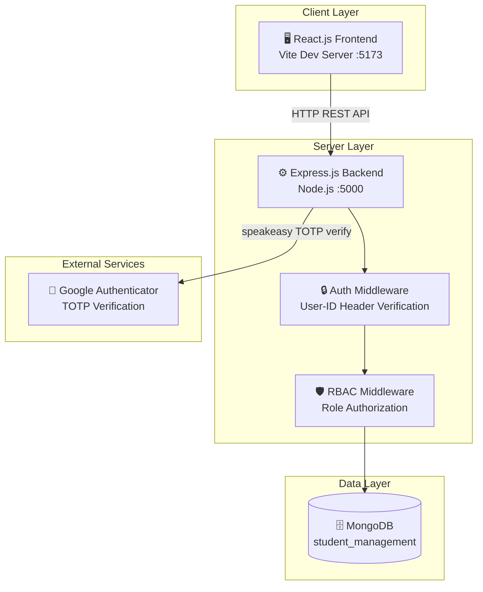

## Client-Server Architecture

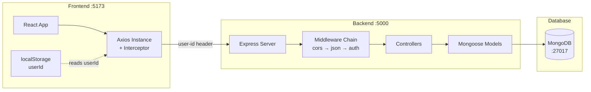

## Request-Response Flow

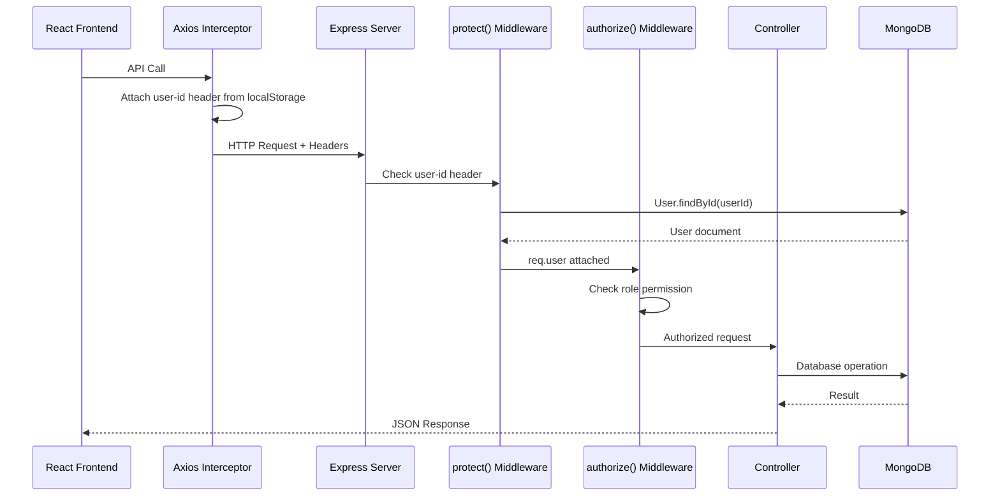

## Component Architecture

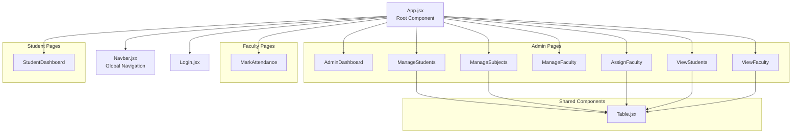

## Database Architecture

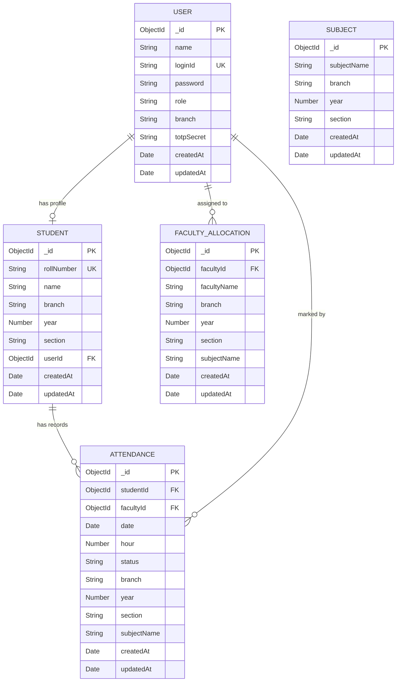

---

# 5. Folder Structure

## Complete Project Structure

```
Major-Project/
│
├── 📁 server/                          # Backend (Node.js + Express)
│   ├── 📄 .env                         # Environment variables (PORT, MONGO_URI)
│   ├── 📄 package.json                 # Backend dependencies and scripts
│   ├── 📄 server.js                    # Application entry point
│   ├── 📄 seed.js                      # Database seeding script
│   │
│   ├── 📁 config/
│   │   └── 📄 db.js                    # MongoDB connection logic
│   │
│   ├── 📁 models/                      # Mongoose schemas
│   │   ├── 📄 User.js                  # User model (Admin/Faculty/Student)
│   │   ├── 📄 Student.js               # Student profile model
│   │   ├── 📄 Subject.js               # Subject model with compound index
│   │   ├── 📄 FacultyAllocation.js     # Faculty-to-class-subject mapping
│   │   └── 📄 Attendance.js            # Hour-wise attendance records
│   │
│   ├── 📁 controllers/                 # Business logic handlers
│   │   ├── 📄 authController.js        # Login (TOTP + bcrypt) and getMe
│   │   ├── 📄 studentController.js     # Student CRUD operations
│   │   ├── 📄 subjectController.js     # Subject create and list
│   │   ├── 📄 facultyController.js     # Faculty CRUD, allocations, QR gen
│   │   └── 📄 attendanceController.js  # Mark, query, and calculate attendance
│   │
│   ├── 📁 middleware/
│   │   └── 📄 authMiddleware.js        # protect() and authorize() middleware
│   │
│   └── 📁 routes/                      # Express route definitions
│       ├── 📄 authRoutes.js            # /api/auth
│       ├── 📄 studentRoutes.js         # /api/students
│       ├── 📄 subjectRoutes.js         # /api/subjects
│       ├── 📄 facultyRoutes.js         # /api/faculty-allocations
│       └── 📄 attendanceRoutes.js      # /api/attendance
│
└── 📁 client/                          # Frontend (React + Vite)
    ├── 📄 index.html                   # HTML entry point
    ├── 📄 package.json                 # Frontend dependencies
    ├── 📄 vite.config.js               # Vite configuration
    │
    └── 📁 src/
        ├── 📄 main.jsx                 # React DOM render + BrowserRouter
        ├── 📄 App.jsx                  # Root component, routing, session mgmt
        ├── 📄 index.css                # Global custom styles
        ├── 📄 App.css                  # App-level styles
        │
        ├── 📁 services/
        │   └── 📄 api.js              # Axios instance + all API functions
        │
        ├── 📁 components/              # Reusable UI components
        │   ├── 📄 Navbar.jsx           # Role-based navigation bar
        │   └── 📄 Table.jsx            # Generic data table component
        │
        └── 📁 pages/                   # Page-level components
            ├── 📄 Login.jsx            # Login form (TOTP + password)
            ├── 📄 AdminDashboard.jsx   # Admin landing page with 6 cards
            ├── 📄 ManageStudents.jsx   # Student CRUD interface
            ├── 📄 ManageSubjects.jsx   # Subject creation and listing
            ├── 📄 ManageFaculty.jsx    # Faculty creation with QR code
            ├── 📄 AssignFaculty.jsx    # Faculty allocation CRUD
            ├── 📄 ViewStudents.jsx     # Filtered student query view
            ├── 📄 ViewFaculty.jsx      # Filtered faculty query view
            ├── 📄 MarkAttendance.jsx   # Faculty attendance marking
            └── 📄 StudentDashboard.jsx # Student attendance analytics
```

### Key Files Explained

| File | Purpose |
|------|---------|
| `server.js` | Express app initialization, middleware chain, route mounting, DB connection, error handler |
| `seed.js` | One-time script to populate database with demo Admin, Faculty, Students, Subjects, Allocations, and Attendance records |
| `authMiddleware.js` | Two-layer security: `protect()` validates user identity, `authorize()` enforces role permissions |
| `api.js` | Centralized Axios instance with request interceptor that auto-attaches `user-id` header from localStorage |
| `App.jsx` | Root component managing user state, route guards, session timeout (10 min), and global Navbar |
| `Table.jsx` | Generic reusable table accepting dynamic columns with optional custom render functions |

---

# 6. User Roles & Permissions

## Role-Based Access Control (RBAC) Matrix

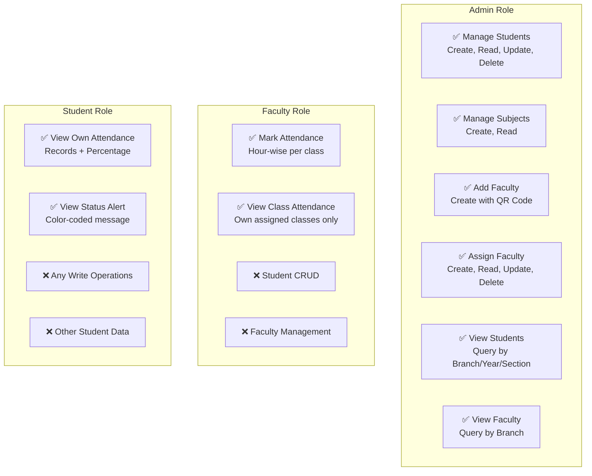

## Detailed Permissions Table

| Feature | Admin | Faculty | Student |
|---------|:-----:|:-------:|:-------:|
| Login with TOTP (Google Authenticator) | ✅ | ✅ | ❌ |
| Login with Password | ❌ | ❌ | ✅ |
| Access Admin Dashboard | ✅ | ❌ | ❌ |
| Create/Edit/Delete Students | ✅ | ❌ | ❌ |
| Create Subjects | ✅ | ❌ | ❌ |
| View Subjects | ✅ | ✅ | ❌ |
| Create Faculty Accounts (with QR) | ✅ | ❌ | ❌ |
| Assign Faculty to Classes | ✅ | ❌ | ❌ |
| Edit/Delete Faculty Allocations | ✅ | ❌ | ❌ |
| View All Students (filtered) | ✅ | ❌ | ❌ |
| View All Faculty (filtered) | ✅ | ❌ | ❌ |
| View Own Allocations | ❌ | ✅ | ❌ |
| Mark Attendance | ❌ | ✅ | ❌ |
| View Class Attendance Records | ❌ | ✅ | ❌ |
| View Own Attendance | ❌ | ❌ | ✅ |
| View Attendance Percentage | ❌ | ❌ | ✅ |

## Route Protection

| Route Pattern | Required Role | Middleware |
|---------------|---------------|-----------|
| `POST /api/auth` | None | None |
| `GET /api/auth/me` | Any authenticated | `protect` |
| `/api/students/*` (write) | Admin | `protect`, `authorize('admin')` |
| `/api/subjects` (POST) | Admin | `protect`, `authorize('admin')` |
| `/api/faculty-allocations/create` | Admin | `protect`, `authorize('admin')` |
| `/api/faculty-allocations/list` | Admin | `protect`, `authorize('admin')` |
| `/api/faculty-allocations/:id` (PUT/DELETE) | Admin | `protect`, `authorize('admin')` |
| `POST /api/attendance` | Faculty | `protect`, `authorize('faculty')` |
| `GET /api/attendance/class` | Faculty | `protect`, `authorize('faculty')` |
| `GET /api/attendance/bunkers` | Admin | `protect`, `authorize('admin')` |
| `GET /api/attendance/my-*` | Student | `protect`, `authorize('student')` |

---

# 7. Authentication & Authorization Flow

## Authentication Methods

This application uses a **dual authentication strategy**:

| Role | Method | Library | How It Works |
|------|--------|---------|-------------|
| **Admin** | TOTP (Time-based One-Time Password) | `speakeasy` | 6-digit code from Google Authenticator app |
| **Faculty** | TOTP (Time-based One-Time Password) | `speakeasy` | 6-digit code from Google Authenticator app |
| **Student** | Static Password (bcrypt hashed) | `bcryptjs` | Password = Roll Number (hashed with salt 10) |

## Login Flow Diagram

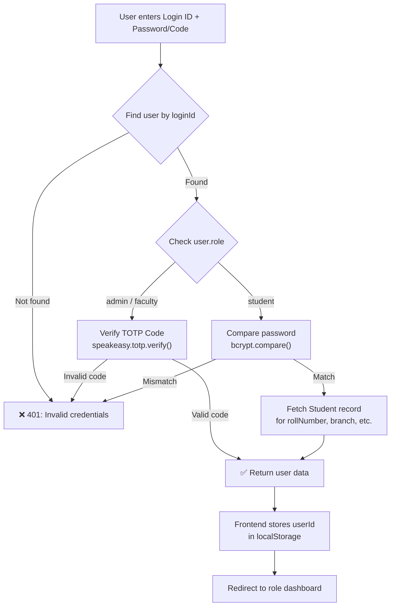

## Session Management Flow

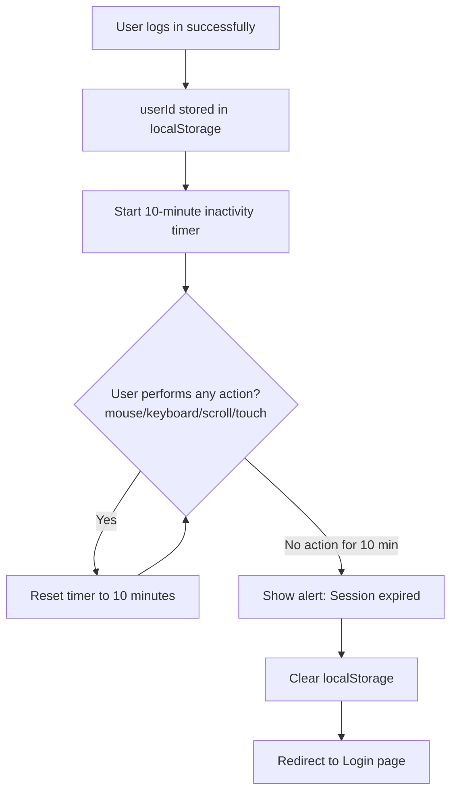

## Authorization Middleware Flow

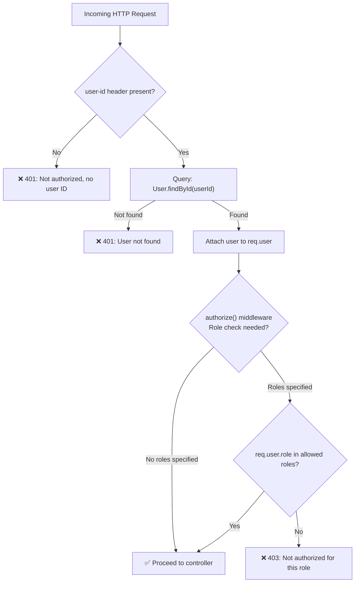

## Faculty Account Creation & 2FA Setup Flow

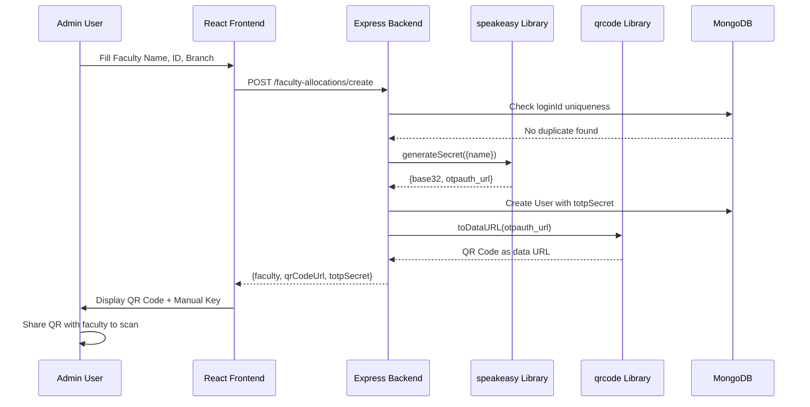

---

# 8. Complete User Flow

## Admin User Journey

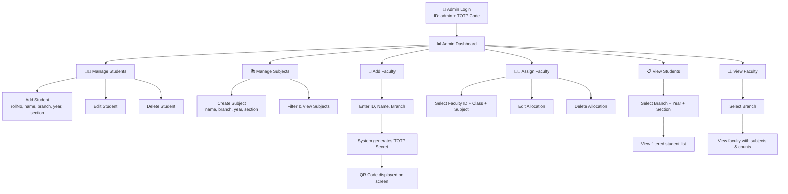

## Faculty User Journey

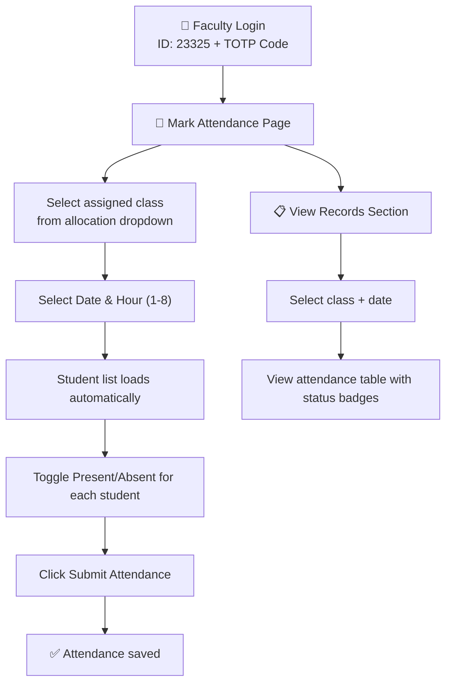

## Student User Journey

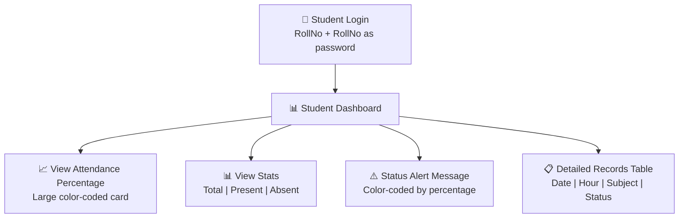

## CRUD Operation Flows

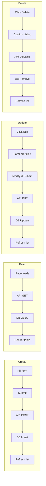

---

# 9. Features Documentation

## Feature 1: Student Management (CRUD)

| Aspect | Detail |
|--------|--------|
| **Feature Name** | Manage Students |
| **Purpose** | Full CRUD operations on student records |
| **Page** | `/admin/students` — `ManageStudents.jsx` |
| **Access** | Admin only |
| **Form Fields** | rollNumber, name, branch (CSE/ECE/EEE/MECH/CIVIL), year (1–4), section (A/B/C) |
| **Auto-Generated** | User account with `loginId = rollNumber`, `password = bcrypt(rollNumber)` |
| **API — Create** | `POST /api/students` — Creates User + Student records |
| **API — Read** | `GET /api/students` — Lists all with populated user data |
| **API — Update** | `PUT /api/students/:id` — Updates student and linked user |
| **API — Delete** | `DELETE /api/students/:id` — Removes both Student and User records |
| **Validation** | Duplicate rollNumber check, duplicate loginId check |
| **Table Columns** | Roll Number, Name, Branch, Year, Section, Actions |
| **Edit Mode** | Click Edit → form pre-fills → button changes to "Update Student" + Cancel |
| **Delete** | Confirmation dialog via `window.confirm()` |

## Feature 2: Subject Management

| Aspect | Detail |
|--------|--------|
| **Feature Name** | Manage Subjects |
| **Purpose** | Create subjects and view/filter them |
| **Page** | `/admin/subjects` — `ManageSubjects.jsx` |
| **Access** | Admin (create), Any authenticated (view) |
| **Form Fields** | subjectName, branch, year, section |
| **Uniqueness** | Compound unique index on `{subjectName, branch, year, section}` |
| **API — Create** | `POST /api/subjects` |
| **API — Read** | `GET /api/subjects?branch=&year=&section=` |
| **Filter Panel** | Branch, Year, Section dropdowns with Filter button |

## Feature 3: Faculty Account Creation with 2FA

| Aspect | Detail |
|--------|--------|
| **Feature Name** | Add Faculty |
| **Purpose** | Create faculty accounts with instant Google Authenticator QR setup |
| **Page** | `/admin/faculty` — `ManageFaculty.jsx` |
| **Access** | Admin only |
| **Form Fields** | Faculty ID (custom), Faculty Name, Department/Branch |
| **Process** | 1. Admin enters ID, name, branch → 2. Backend generates TOTP secret → 3. Creates User → 4. Generates QR code → 5. Returns QR + secret |
| **API** | `POST /api/faculty-allocations/create` |
| **Output** | QR code image (250×250px), Faculty Login ID, Manual setup key |
| **Validation** | Duplicate loginId check, all fields required |
| **Security** | TOTP secret stored as base32 in database, QR code is a data URL (not stored) |

## Feature 4: Faculty Allocation (CRUD)

| Aspect | Detail |
|--------|--------|
| **Feature Name** | Assign Faculty |
| **Purpose** | Map faculty members to specific class+subject combinations |
| **Page** | `/admin/assign` — `AssignFaculty.jsx` |
| **Access** | Admin only |
| **Form Fields** | Faculty ID (5-digit), Faculty Name, Branch, Year, Section, Subject (dynamic dropdown) |
| **Dynamic Loading** | Subject dropdown auto-populates when Branch+Year+Section are selected |
| **Faculty Validation** | Backend verifies Faculty ID exists as a user with role 'faculty' before creating allocation |
| **API — Create** | `POST /api/faculty-allocations` |
| **API — Read** | `GET /api/faculty-allocations` (populated with loginId) |
| **API — Update** | `PUT /api/faculty-allocations/:id` |
| **API — Delete** | `DELETE /api/faculty-allocations/:id` |
| **Table Columns** | Faculty Name, Subject, Branch, Year, Section, Faculty ID, Actions |

## Feature 5: Hour-Wise Attendance Marking

| Aspect | Detail |
|--------|--------|
| **Feature Name** | Mark Attendance |
| **Purpose** | Faculty marks attendance per hour per subject |
| **Page** | `/faculty` — `MarkAttendance.jsx` |
| **Access** | Faculty only |
| **Workflow** | 1. Select allocation (auto-filtered to own) → 2. Select date + hour (1–8) → 3. Students list loads → 4. Toggle present/absent → 5. Submit |
| **API — Mark** | `POST /api/attendance` — Batch upsert with `updateOne + upsert: true` |
| **API — View** | `GET /api/attendance/class?branch=&year=&section=&subjectName=&date=` |
| **Upsert Logic** | If record exists for same student+date+hour+subject, it updates instead of creating duplicate |
| **Constraint** | Compound unique index on `{studentId, date, hour, subjectName}` |

## Feature 6: Student Attendance Dashboard

| Aspect | Detail |
|--------|--------|
| **Feature Name** | Student Dashboard |
| **Purpose** | Students view their own attendance analytics |
| **Page** | `/student` — `StudentDashboard.jsx` |
| **Access** | Student only (sees only own data) |
| **API Calls** | `GET /api/attendance/my-attendance`, `GET /api/attendance/my-percentage` |
| **Stats Displayed** | Total Hours, Present Hours, Absent Hours, Percentage |
| **Percentage Calculation** | `(presentHours / totalHours) × 100` |
| **Status Rules** | Below 65% → Red Alert (detained) · 65–75% → Warning (condonation) · 75–80% → Good · Above 80% → Excellent |
| **Color Coding** | `bg-danger` / `bg-warning` / `bg-info` / `bg-success` |
| **Records Table** | #, Date, Hour, Subject, Status (with colored badge) |

## Feature 7: View Students (Query)

| Aspect | Detail |
|--------|--------|
| **Feature Name** | View Students |
| **Page** | `/admin/view-students` — `ViewStudents.jsx` |
| **Access** | Admin only |
| **Form** | Branch + Year + Section dropdowns → "Show Students" button |
| **Table Format** | SNO, RollNo, Student Name |
| **API** | `GET /api/students?branch=&year=&section=` |

## Feature 8: View Faculty (Query)

| Aspect | Detail |
|--------|--------|
| **Feature Name** | View Faculty |
| **Page** | `/admin/view-faculty` — `ViewFaculty.jsx` |
| **Access** | Admin only |
| **Form** | Branch dropdown → "Show Faculty" button |
| **Table Format** | SNO, Faculty ID, Faculty Name, Subjects Assigned, Total Assigned |
| **API** | `GET /api/faculty-allocations/list?branch=` |
| **Backend Logic** | Queries Users with role=faculty, cross-references FacultyAllocation to compute subjects |

## Feature 9: Session Timeout (Auto-Logout)

| Aspect | Detail |
|--------|--------|
| **Feature Name** | 10-Minute Inactivity Auto-Logout |
| **Purpose** | Security — prevent unauthorized access on unattended machines |
| **Implementation** | `useEffect` hook in `App.jsx` |
| **Monitored Events** | `mousemove`, `keydown`, `mousedown`, `scroll`, `touchstart` |
| **Timeout** | 600,000 ms (10 minutes) |
| **On Expiry** | Alert shown → localStorage cleared → user redirected to login |
| **Reset** | Any monitored event resets the countdown to full 10 minutes |

## Feature 10: Department-Wise Bunkers List

| Aspect | Detail |
|--------|--------|
| **Feature Name** | Department-Wise Bunkers List |
| **Purpose** | Identify and list students who attended early hours but skipped subsequent hours on a specific date (bunking) |
| **Page** | `/admin/bunkers` — `AdminBunkersList.jsx` |
| **Access** | Admin only |
| **Inputs** | Branch (dropdown), Date (picker) |
| **Algorithm** | 1. Query all attendance records for the selected branch and date. <br/> 2. Group records by student. <br/> 3. Sort attendance records by hour for each student. <br/> 4. A student is flagged as a "bunker" if there is at least one hour marked 'present' followed by any subsequent hour marked 'absent' on the same day. |
| **API** | `GET /api/attendance/bunkers?branch=&date=` |
| **UI Components** | - Metric card for total department bunkers count on the date.<br/>- Year-wise breakdown counts cards (1st to 4th year).<br/>- Sorted table showing: S.No, Year, Roll No, Student Name, Section, Bunked Hours (Today), and Total Bunks (All Time).<br/>- High-Risk tag highlighted in red for students with 10+ all-time bunks. |

## Feature 11: Dedicated Faculty Attendance Viewer

| Aspect | Detail |
|--------|--------|
| **Feature Name** | Dedicated View Attendance Page |
| **Purpose** | Allows faculty to query past attendance records in a clean layout separate from the data entry flow |
| **Page** | `/faculty/view-attendance` — `FacultyViewAttendance.jsx` |
| **Access** | Faculty only |
| **Inputs** | Branch / Class Allocation, Date, Hour (dropdown with "All Hours" option) |
| **API** | `GET /api/attendance/class?branch=&year=&section=&subjectName=&date=&hour=` |
| **Filtering** | Allows viewing attendance records filtered by a specific hour or aggregated for all hours on that day |
| **UI Components** | Clean table displaying Student Roll Number, Student Name, and Attendance Status (Present/Absent) with colored badges. |

## Feature 12: Premium Light Theme Redesign

| Aspect | Detail |
|--------|--------|
| **Feature Name** | Clean Indigo Light Theme |
| **Purpose** | Replaces the heavy high-contrast black/white theme with a beautiful, professional, and readable light interface |
| **Scope** | Global (all pages, dashboards, navigation headers, forms, tables, and alert systems) |
| **Aesthetics** | - **Typography:** Plus Jakarta Sans font loaded from Google Fonts.<br/>- **Color Palette:** HSL-tailored Indigo primary (`#4f46e5`), soft radial gradients for body background, and crisp neutral card backings.<br/>- **Glassmorphism:** Frosted-glass navigation bar (`custom-navbar` class) with backdrop filter, thin border, and subtle drop shadow.<br/>- **Badges:** Soft desaturated background colors and vibrant text colors for success, warning, danger, and info states. |

---

# 10. API Documentation

## Authentication APIs

| # | Method | Endpoint | Auth | Body / Params | Success Response | Error Codes |
|---|--------|----------|------|---------------|-----------------|-------------|
| 1 | POST | `/api/auth` | None | `{ loginId, password }` | `200: { user: { _id, name, loginId, role, ... } }` | 401, 500 |
| 2 | GET | `/api/auth/me` | `protect` | Header: `user-id` | `200: { _id, name, loginId, role, rollNumber?, branch?, ... }` | 401, 500 |

## Student APIs

| # | Method | Endpoint | Auth | Body / Params | Success Response | Error Codes |
|---|--------|----------|------|---------------|-----------------|-------------|
| 3 | POST | `/api/students` | Admin | `{ rollNumber, name, branch, year, section }` | `201: Student object` | 400, 500 |
| 4 | GET | `/api/students` | Admin | Query: `?branch=&year=&section=` | `200: [Student]` | 500 |
| 5 | GET | `/api/students/:id` | Auth | Param: `id` | `200: Student` | 404, 500 |
| 6 | PUT | `/api/students/:id` | Admin | `{ rollNumber?, name?, branch?, year?, section?, password? }` | `200: Updated Student` | 404, 500 |
| 7 | DELETE | `/api/students/:id` | Admin | Param: `id` | `200: { message }` | 404, 500 |

## Subject APIs

| # | Method | Endpoint | Auth | Body / Params | Success Response | Error Codes |
|---|--------|----------|------|---------------|-----------------|-------------|
| 8 | POST | `/api/subjects` | Admin | `{ subjectName, branch, year, section }` | `201: Subject object` | 500 |
| 9 | GET | `/api/subjects` | Auth | Query: `?branch=&year=&section=` | `200: [Subject]` | 500 |

## Faculty Allocation APIs

| # | Method | Endpoint | Auth | Body / Params | Success Response | Error Codes |
|---|--------|----------|------|---------------|-----------------|-------------|
| 10 | POST | `/api/faculty-allocations` | Admin | `{ facultyId, facultyName, branch, year, section, subjectName }` | `201: Allocation` | 404, 500 |
| 11 | POST | `/api/faculty-allocations/create` | Admin | `{ name, loginId, branch }` | `201: { faculty, qrCodeUrl, totpSecret }` | 400, 500 |
| 12 | GET | `/api/faculty-allocations/list` | Admin | Query: `?branch=` | `200: [{ loginId, name, branch, subjectsAssigned, totalAssigned }]` | 500 |
| 13 | GET | `/api/faculty-allocations` | Admin/Faculty | Query: `?branch=&year=&section=` | `200: [Allocation] (populated)` | 500 |
| 14 | PUT | `/api/faculty-allocations/:id` | Admin | `{ facultyId, facultyName, branch, year, section, subjectName }` | `200: Updated Allocation` | 404, 500 |
| 15 | DELETE | `/api/faculty-allocations/:id` | Admin | Param: `id` | `200: { message }` | 404, 500 |

## Attendance APIs

| # | Method | Endpoint | Auth | Body / Params | Success Response | Error Codes |
|---|--------|----------|------|---------------|-----------------|-------------|
| 16 | POST | `/api/attendance` | Faculty | `{ students: [{studentId, status}], date, hour, branch, year, section, subjectName }` | `200: { message, count }` | 500 |
| 17 | GET | `/api/attendance/class` | Faculty | Query: `?branch=&year=&section=&subjectName=&date=&hour=` | `200: [Attendance] (populated)` | 500 |
| 18 | GET | `/api/attendance/student/:studentId` | Auth | Param + Query filters | `200: [Attendance]` | 500 |
| 19 | GET | `/api/attendance/my-attendance` | Student | Header: `user-id` | `200: [Attendance]` | 500 |
| 20 | GET | `/api/attendance/my-percentage` | Student | Header: `user-id` | `200: { percentage, status, totalHours, presentHours, absentHours }` | 500 |
| 21 | GET | `/api/attendance/bunkers` | Admin | Query: `?branch=&date=` | `200: [{ studentId, rollNumber, name, year, section, bunkedHoursToday: [Number], totalBunks: Number }]` | 400, 500 |

---

# 11. Database Documentation

## Entity-Relationship Diagram

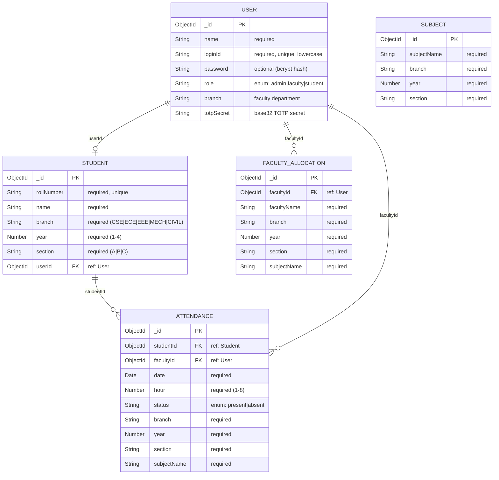

## Indexes

| Collection | Index Fields | Type | Purpose |
|-----------|-------------|------|---------|
| `User` | `loginId` | Unique | Prevent duplicate login IDs |
| `Student` | `rollNumber` | Unique | Prevent duplicate roll numbers |
| `Subject` | `{subjectName, branch, year, section}` | Compound Unique | One subject per class |
| `Attendance` | `{studentId, date, hour, subjectName}` | Compound Unique | Prevent duplicate attendance per hour |

## Collection Relationships

| From | To | Relationship | Field | Description |
|------|----|-------------|-------|-------------|
| Student | User | Many-to-One | `userId` | Each student has one user account |
| FacultyAllocation | User | Many-to-One | `facultyId` | Each allocation references a faculty user |
| Attendance | Student | Many-to-One | `studentId` | Each record belongs to one student |
| Attendance | User | Many-to-One | `facultyId` | Each record was marked by one faculty |

---

# 12. Frontend Documentation

## UI Architecture
The frontend follows a **Single Page Application (SPA)** architecture built with React 19 and Vite. It uses a component-based structure with clear separation between pages, shared components, and services.

## Reusable Components

### `Table.jsx`
A fully generic, data-driven table component.

```jsx
<Table
  columns={[
    { header: 'SNO', accessor: 'sno', render: (_, index) => index + 1 },
    { header: 'Name', accessor: 'name' },
    { header: 'Actions', accessor: 'actions', render: (row) => <button>Edit</button> }
  ]}
  data={[{ name: 'John' }, { name: 'Jane' }]}
/>
```

- Accepts `columns` array with `header`, `accessor`, and optional `render(row, rowIndex)` function
- Accepts `data` array of objects
- Renders Bootstrap-styled table with dark header
- Shows "No records found" when data is empty
- Used across 5+ pages for consistent table rendering

### `Navbar.jsx`
Global navigation component rendered once in `App.jsx`.

- Bootstrap dark navbar with brand link
- Conditionally renders navigation links based on `user.role`
- Displays user name and role badge on the right
- Red logout button triggers `handleLogout()`

## State Management
The application uses **React built-in state** (`useState`, `useEffect`, `useCallback`) — no external state management library.

- **Global state**: `user` object managed in `App.jsx`, passed via props
- **Local state**: Each page manages its own form state, loading state, and data
- **Persistent state**: `userId` stored in `localStorage` for session persistence across refreshes

## Routing
React Router DOM v7 with `BrowserRouter`:

- **Public route**: `/` (Login)
- **Protected routes**: Conditional rendering based on `user.role`
- **Catch-all**: `*` redirects to `/`
- **Role-based redirect**: After login, users are redirected to their role dashboard

## Forms & Validation
- All forms use controlled components with `useState`
- HTML5 `required` attribute for client-side validation
- Server-side validation in controllers (duplicate checks, required fields)
- Error messages displayed via Bootstrap alert components

## Responsive Design
- Bootstrap 5 grid system (`row`, `col-md-*`)
- `table-responsive` wrapper for all tables
- Cards and forms scale on smaller screens
- Navbar uses Bootstrap's responsive collapse

---

# 13. Backend Documentation

## Server Architecture

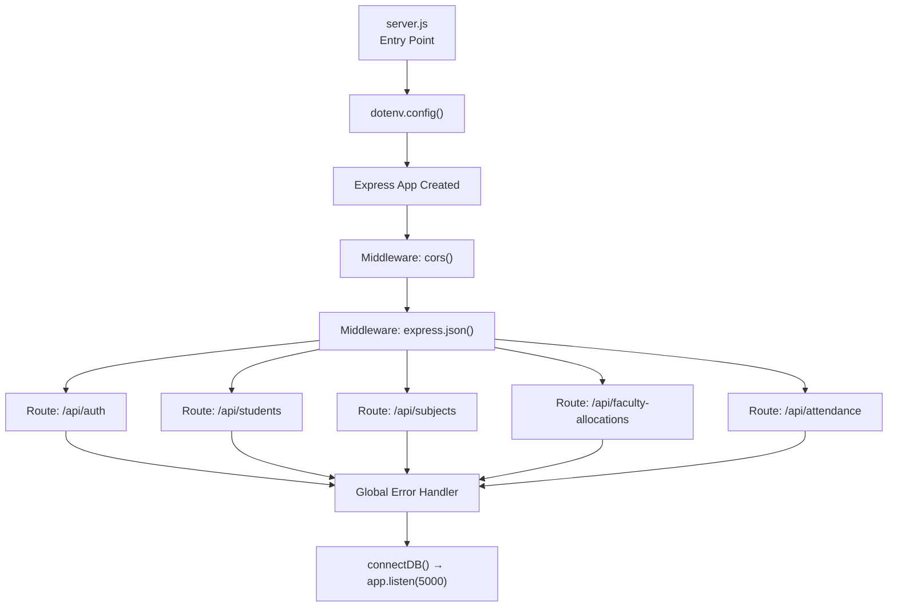

## Controller Layer
Each controller handles one domain of business logic:

| Controller | Functions | Domain |
|-----------|-----------|--------|
| `authController` | `login`, `getMe` | Authentication |
| `studentController` | `createStudent`, `getAllStudents`, `getStudentById`, `updateStudent`, `deleteStudent` | Student CRUD |
| `subjectController` | `createSubject`, `getAllSubjects` | Subject management |
| `facultyController` | `createAllocation`, `getAllAllocations`, `updateAllocation`, `deleteAllocation`, `createFaculty`, `getFacultyList` | Faculty & Allocations |
| `attendanceController` | `markAttendance`, `getClassAttendance`, `getStudentAttendance`, `getMyAttendance`, `getMyPercentage` | Attendance operations |

## Middleware Layer

| Middleware | Type | Purpose |
|-----------|------|---------|
| `cors()` | Third-party | Allow cross-origin requests from frontend |
| `express.json()` | Built-in | Parse JSON request bodies |
| `protect()` | Custom | Verify user identity via user-id header |
| `authorize(...roles)` | Custom | Enforce role-based access control |

## Error Handling
- **Controller level**: Every controller wraps logic in `try/catch`, returning appropriate HTTP status codes
- **Global handler**: `app.use((err, req, res, next) => ...)` catches uncaught errors, logs stack trace, returns 500
- **Validation errors**: Return 400 with descriptive message
- **Not found**: Return 404 with entity-specific message
- **Auth errors**: Return 401 (unauthenticated) or 403 (unauthorized)

---

# 14. Seed Data & Default Credentials

## Seeded Accounts

| Role | Login ID | Auth Method | Branch | Notes |
|------|----------|-------------|--------|-------|
| Admin | `admin` | Google Authenticator TOTP | — | Secret printed to console on `npm run seed` |
| Faculty | `23325` | Google Authenticator TOTP | CSE | Prof. Vishnu |
| Faculty | `23326` | Google Authenticator TOTP | ECE | Prof. Lakshmi |
| Student | `235801` | Password: `235801` | CSE (Y2, Sec A) | Ravi Kumar |
| Student | `235802` | Password: `235802` | CSE (Y2, Sec A) | Priya Sharma |
| Student | `235803` | Password: `235803` | ECE (Y3, Sec B) | Arjun Reddy |
| Student | `235804` | Password: `235804` | ECE (Y3, Sec B) | Sneha Patel |

## Seeded Subjects

| Subject | Branch | Year | Section |
|---------|--------|------|---------|
| Data Structures | CSE | 2 | A |
| Database Systems | CSE | 2 | A |
| Signal Processing | ECE | 3 | B |

## Seeded Faculty Allocations

| Faculty | Subject | Class |
|---------|---------|-------|
| Prof. Vishnu | Data Structures | CSE / Y2 / Sec A |
| Prof. Vishnu | Database Systems | CSE / Y2 / Sec A |
| Prof. Lakshmi | Signal Processing | ECE / Y3 / Sec B |

## Seeded Attendance (16 records)

| Student | Present | Absent | Percentage |
|---------|---------|--------|-----------|
| Ravi Kumar | 7 | 1 | 87.5% (Excellent) |
| Priya Sharma | 5 | 3 | 62.5% (Red Alert) |

---

# 15. Security Implementation

| Security Feature | Implementation | Details |
|-----------------|----------------|---------|
| **TOTP 2FA** | `speakeasy` library | Admin and Faculty authenticate using time-based 6-digit codes from Google Authenticator. Window tolerance of ±1 interval (30 seconds). |
| **Password Hashing** | `bcryptjs` with salt 10 | Student passwords are hashed before storage. Never stored in plain text. |
| **CORS** | `cors` middleware | Enabled globally to allow frontend (:5173) to communicate with backend (:5000). |
| **Input Validation** | Controller-level checks | Required field validation, duplicate checks, role verification before operations. |
| **Session Timeout** | Frontend timer (10 min) | Monitors mouse, keyboard, scroll, and touch events. Auto-logout on 10 minutes of inactivity. |
| **Role-Based Access** | `authorize()` middleware | Route-level enforcement of role permissions. Returns 403 for unauthorized roles. |
| **Identity Verification** | `protect()` middleware | Every protected route verifies the user-id header against the database. |
| **Sensitive Data Exclusion** | `.select('-password -totpSecret')` | TOTP secrets and passwords are excluded from API responses where applicable. |
| **Environment Variables** | `dotenv` | MongoDB URI and PORT are kept in `.env`, not committed to version control. |
| **Unique Constraints** | MongoDB indexes | Prevent duplicate loginIds, rollNumbers, and attendance records. |

---

# 16. Performance Optimization

| Technique | Where | Implementation |
|-----------|-------|----------------|
| **Compound Indexes** | MongoDB | Unique compound indexes on Subject and Attendance for fast lookups and constraint enforcement |
| **Selective Population** | Backend queries | `populate('userId', 'name loginId')` — only fetches needed fields, not entire documents |
| **Batch Upsert** | Attendance marking | Single API call handles entire class attendance using `updateOne` with `upsert: true` per student |
| **Conditional Fetching** | Frontend | Subjects only fetched when branch+year+section are all selected (not on every keystroke) |
| **Controlled Components** | React forms | State updates only on user input, preventing unnecessary re-renders |
| **Single Navbar Instance** | App.jsx | One Navbar rendered globally, not duplicated per page |
| **localStorage Persistence** | Session | Avoids re-authentication on page refresh by storing userId locally |
| **Vite Build Tool** | Frontend | HMR (Hot Module Replacement) for instant dev feedback, tree-shaking for production builds |

---

# 17. Deployment Documentation

## Local Development Setup

### Prerequisites
- Node.js (v18+ recommended)
- MongoDB (running locally on port 27017)
- Google Authenticator app (on your smartphone)

### Step-by-Step Installation

```bash
# 1. Clone the repository
git clone <repository-url>
cd Major-Project

# 2. Setup Backend
cd server
npm install
cp .env.example .env    # Configure environment variables

# 3. Seed the Database
npm run seed
# ⚠️ Save the TOTP secrets printed in the console!

# 4. Start Backend Server
npm run dev              # Runs on http://localhost:5000

# 5. Setup Frontend (new terminal)
cd ../client
npm install

# 6. Start Frontend Dev Server
npm run dev              # Runs on http://localhost:5173
```

### Build for Production

```bash
# Frontend production build
cd client
npm run build           # Output in client/dist/

# Backend production start
cd server
npm start               # Uses node server.js (no auto-restart)
```

### Google Authenticator Setup
1. Run `npm run seed` in the server directory
2. Copy the TOTP secret for the Admin account from the console output
3. Open Google Authenticator → Tap `+` → "Enter a setup key"
4. Account Name: `Admin`, Key: `<paste secret>`, Type: Time-based
5. Use the 6-digit code to log in as Admin

---

# 18. Environment Variables

## Backend `.env`

```env
# Server Configuration
PORT=5000                                          # Express server port

# Database Configuration
MONGO_URI=mongodb://localhost:27017/student_management  # MongoDB connection string
```

| Variable | Required | Default | Description |
|----------|----------|---------|-------------|
| `PORT` | No | `5000` | Port on which Express server listens |
| `MONGO_URI` | Yes | — | Full MongoDB connection URI including database name |

## Frontend Configuration
The frontend uses Vite's default configuration. The backend URL (`http://localhost:5000/api`) is hardcoded in `src/services/api.js`. For production, this should be moved to a Vite environment variable:

```env
# client/.env (recommended for production)
VITE_API_URL=http://localhost:5000/api
```

---

# 19. Error Handling

## Backend Error Strategy

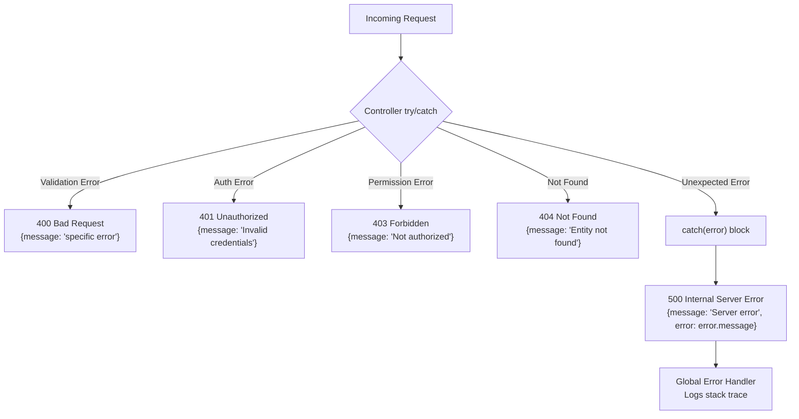

## Error Response Format

```json
{
  "message": "Human-readable error description",
  "error": "Technical error message (development only)"
}
```

## Frontend Error Handling
- **API errors**: Caught in `try/catch` blocks, displayed via Bootstrap `alert-danger` components
- **Fallback messages**: `err.response?.data?.message || 'Default error message'`
- **Loading states**: Spinner shown during API calls to prevent double submissions
- **Empty states**: "No records found" messages for empty data sets

---

# 20. Testing Documentation

## Manual Testing Checklist

### Authentication Tests
- [ ] Admin login with valid TOTP code → Redirects to Admin Dashboard
- [ ] Admin login with invalid TOTP code → Shows error
- [ ] Faculty login with valid TOTP code → Redirects to Mark Attendance
- [ ] Student login with valid password (rollNumber) → Redirects to Student Dashboard
- [ ] Login with non-existent loginId → Shows error
- [ ] Session timeout after 10 min inactivity → Auto-logout with alert

### Admin CRUD Tests
- [ ] Create student → Appears in table
- [ ] Create duplicate rollNumber → Shows error
- [ ] Edit student → Updated data in table
- [ ] Delete student → Removed from table and user deleted
- [ ] Create subject → Appears in filtered list
- [ ] Create duplicate subject for same class → Shows error
- [ ] Create faculty → QR code displayed
- [ ] Create faculty with duplicate ID → Shows error
- [ ] Assign faculty to class → Appears in allocations table
- [ ] Assign faculty with invalid Faculty ID → Shows "not found" error
- [ ] Edit allocation → Updated in table
- [ ] Delete allocation → Removed from table

### Faculty Tests
- [ ] Faculty sees only own allocations
- [ ] Mark attendance for all students → Success message
- [ ] View class attendance records → Table populated
- [ ] Re-mark attendance for same hour → Updates (upsert)

### Student Tests
- [ ] Student sees own percentage and stats
- [ ] Student with <65% → Red Alert status
- [ ] Student with >80% → Excellent status
- [ ] Student sees detailed attendance records

### API Testing (Postman/cURL)

```bash
# Login as Student
curl -X POST http://localhost:5000/api/auth \
  -H "Content-Type: application/json" \
  -d '{"loginId": "235801", "password": "235801"}'

# Get all students (requires admin user-id)
curl http://localhost:5000/api/students \
  -H "user-id: <admin-user-objectid>"

# Get student attendance percentage
curl http://localhost:5000/api/attendance/my-percentage \
  -H "user-id: <student-user-objectid>"
```

---

# 21. Screenshots

> Add screenshots of your running application to the `screenshots/` folder and uncomment the lines below.

## Login Page
<!--  -->
*Login form with Login ID and Password/6-digit TOTP Code fields. Helper text for Admin/Faculty Google Authenticator.*

## Admin Dashboard
<!--  -->
*Six navigation cards: Manage Students, Manage Subjects, Add Faculty, Assign Faculty, View Students, View Faculty.*

## Manage Students
<!--  -->
*CRUD form at top, student table below with Edit/Delete actions.*

## Add Faculty (QR Code)
<!--  -->
*Faculty creation form with instant QR code display for Google Authenticator setup.*

## Assign Faculty
<!--  -->
*Faculty allocation form with dynamic subject dropdown, allocation table with Edit/Delete.*

## Mark Attendance (Faculty)
<!--  -->
*Allocation selector, date/hour picker, student list with Present/Absent toggles.*

## Student Dashboard
<!--  -->
*Attendance percentage card (color-coded), stats row, status alert, detailed records table.*

---

# 22. Future Enhancements

| # | Enhancement | Priority | Description |
|---|-------------|----------|-------------|
| 1 | **JWT Token Authentication** | High | Replace user-id header with signed JWT tokens for stronger security |
| 2 | **Email Notifications** | Medium | Alert students when attendance drops below threshold |
| 3 | **Attendance Reports (PDF/Excel)** | High | Export attendance data as downloadable reports |
| 4 | **Mobile Responsive PWA** | Medium | Progressive Web App for mobile-friendly attendance marking |
| 5 | **Bulk Student Upload (CSV)** | High | Admin uploads CSV to create students in bulk |
| 6 | **Dashboard Analytics** | Medium | Charts and graphs for attendance trends over time |
| 7 | **Leave Management** | Low | Students can apply for leave, faculty can approve |
| 8 | **Pagination & Search** | High | Handle large datasets with server-side pagination |
| 9 | **Cloud Deployment** | Medium | Deploy to Render/Railway (backend) + Vercel (frontend) |
| 10 | **OAuth2 / SSO** | Low | College SSO integration for unified login |
| 11 | **Real-Time Notifications** | Low | WebSocket-based alerts for attendance events |
| 12 | **Audit Logging** | Medium | Track all admin actions for compliance |

---

# 23. Challenges Faced

| # | Challenge | Solution |
|---|-----------|----------|
| 1 | **MongoDB duplicate key errors during re-seeding** | Implemented `dropDatabase()` at the start of `seed.js` to clear old indexes and data completely |
| 2 | **JWT complexity for a demo project** | Replaced JWT with a simpler user-id header approach for rapid development, while still maintaining TOTP 2FA for admin/faculty |
| 3 | **Double Navbar rendering** | Initially each page rendered its own Navbar. Centralized it in `App.jsx` and removed from all individual pages |
| 4 | **Faculty ID in allocations showing MongoDB ObjectId** | Added `.populate('facultyId', 'name loginId')` to show human-readable 5-digit IDs |
| 5 | **TOTP verification timing issues** | Used `speakeasy.totp.verify()` with `window: 1` to allow ±30 second tolerance |
| 6 | **View Faculty showing empty results** | Faculty users initially lacked a `branch` field. Added `branch` to the User model and seed data |
| 7 | **Assign Faculty page refreshing instead of navigating** | Dashboard card linked to old route `/admin/assign-faculty` instead of `/admin/assign`. Fixed route consistency |
| 8 | **Table component SNO column not rendering** | Table's render function only received `row`, not `rowIndex`. Updated to pass `(row, rowIndex)` |
| 9 | **SyntaxError: await outside async function** | Accidentally deleted the `const createAllocation = async (req, res) => {` function declaration during code merge. Restored the function signature |
| 10 | **Student password management** | Simplified to use rollNumber as default password, auto-hashed with bcrypt during creation |

---

# 24. Learning Outcomes

## Technical Learnings
- **Full-Stack MERN Development** — End-to-end application development from database schema design to responsive UI
- **TOTP 2FA Implementation** — Learned how time-based one-time passwords work with `speakeasy` and `qrcode` libraries
- **Role-Based Access Control** — Implementing middleware-based authorization with multiple user roles
- **MongoDB Schema Design** — Compound unique indexes, document references, and population queries
- **React Component Architecture** — Building reusable components (Table) with render props pattern
- **RESTful API Design** — Consistent endpoint naming, proper HTTP methods, and status codes
- **Session Management** — Client-side inactivity detection using event listeners

## Architecture Learnings
- **MVC Pattern** — Separation of Models, Controllers, and Routes in Express
- **Service Layer Pattern** — Centralized API service (api.js) with Axios interceptors
- **State Lifting** — Managing global user state in App.jsx and passing via props

## Problem-Solving Skills
- Debugging MongoDB index conflicts across schema changes
- Resolving JSX syntax errors from malformed code edits
- Synchronizing frontend route paths with backend API endpoints
- Handling dual authentication strategies (TOTP vs bcrypt) in a single login flow

---

# 25. Conclusion

The **Student Management Portal** is a production-grade MERN stack application that successfully demonstrates the complete lifecycle of full-stack web development — from database schema design and RESTful API architecture to responsive frontend interfaces and modern security practices.

The application addresses a real-world need in educational institutions by providing a centralized, digital platform for managing students, subjects, faculty assignments, and hour-wise attendance tracking. With three distinct role-based dashboards, Google Authenticator 2FA security, QR code provisioning, real-time attendance analytics, and automatic session management, the project showcases industry-standard practices while remaining clean and maintainable.

Key achievements include:
- **20 RESTful API endpoints** covering authentication, CRUD operations, and analytics
- **5 MongoDB collections** with proper indexing and relationships
- **10 React pages** with role-based access control
- **Dual authentication** using TOTP (Admin/Faculty) and bcrypt (Students)
- **Real-time session security** with 10-minute auto-logout

This project serves as a strong foundation for further enhancements including JWT tokens, cloud deployment, email notifications, and mobile responsiveness.

---

# 26. README / Setup Guide

## Quick Start

```bash
# Clone and navigate
git clone <repository-url>
cd Major-Project

# Backend setup
cd server && npm install
npm run seed    # Seeds database + prints TOTP secrets
npm run dev     # Starts on :5000

# Frontend setup (new terminal)
cd client && npm install
npm run dev     # Starts on :5173
```

## Default Login Credentials

| Role | Login ID | Password |
|------|----------|----------|
| Admin | `admin` | 6-digit Google Authenticator code |
| Faculty | `23325` | 6-digit Google Authenticator code |
| Faculty | `23326` | 6-digit Google Authenticator code |
| Student | `235801` | `235801` |
| Student | `235802` | `235802` |
| Student | `235803` | `235803` |
| Student | `235804` | `235804` |

> ⚠️ Admin and Faculty TOTP secrets are printed to the console when you run `npm run seed`. Scan or manually enter them in Google Authenticator.

## Available Scripts

| Command | Directory | Description |
|---------|-----------|-------------|
| `npm run dev` | `/server` | Start backend with nodemon (auto-reload) |
| `npm start` | `/server` | Start backend (production) |
| `npm run seed` | `/server` | Seed database with demo data |
| `npm run dev` | `/client` | Start Vite dev server |
| `npm run build` | `/client` | Build production bundle |
| `npm run preview` | `/client` | Preview production build |

## Contributing

1. Fork the repository
2. Create a feature branch: `git checkout -b feature/your-feature`
3. Commit your changes: `git commit -m "Add your feature"`
4. Push to the branch: `git push origin feature/your-feature`
5. Open a Pull Request

## License

This project is licensed under the **MIT License**.

---

# 27. Diagrams Index

| # | Diagram | Section | Type |
|---|---------|---------|------|
| 1 | High-Level Architecture | [Section 4](#4-system-architecture) | Mermaid Graph |
| 2 | Client-Server Architecture | [Section 4](#4-system-architecture) | Mermaid Graph |
| 3 | Request-Response Flow | [Section 4](#4-system-architecture) | Mermaid Sequence |
| 4 | Component Architecture | [Section 4](#4-system-architecture) | Mermaid Graph |
| 5 | Database Architecture (ER) | [Section 4](#4-system-architecture) | Mermaid ER |
| 6 | RBAC Permissions | [Section 6](#6-user-roles--permissions) | Mermaid Graph |
| 7 | Login Flow | [Section 7](#7-authentication--authorization-flow) | Mermaid Flowchart |
| 8 | Session Management | [Section 7](#7-authentication--authorization-flow) | Mermaid Flowchart |
| 9 | Auth Middleware Flow | [Section 7](#7-authentication--authorization-flow) | Mermaid Flowchart |
| 10 | Faculty 2FA Setup | [Section 7](#7-authentication--authorization-flow) | Mermaid Sequence |
| 11 | Admin User Journey | [Section 8](#8-complete-user-flow) | Mermaid Flowchart |
| 12 | Faculty User Journey | [Section 8](#8-complete-user-flow) | Mermaid Flowchart |
| 13 | Student User Journey | [Section 8](#8-complete-user-flow) | Mermaid Flowchart |
| 14 | CRUD Operation Flows | [Section 8](#8-complete-user-flow) | Mermaid Flowchart |
| 15 | Full ER Diagram | [Section 11](#11-database-documentation) | Mermaid ER |
| 16 | Server Architecture | [Section 13](#13-backend-documentation) | Mermaid Flowchart |
| 17 | Error Handling Flow | [Section 19](#19-error-handling) | Mermaid Flowchart |

---

<div align="center">

### Built with ❤️ using the MERN Stack

**MongoDB** · **Express.js** · **React.js** · **Node.js**

*Student Management Portal — Major Project*

</div>
